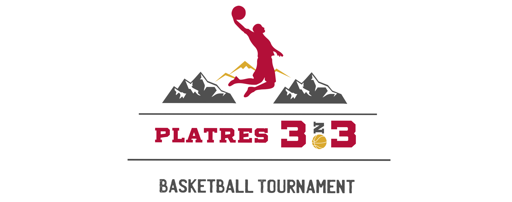

<html lang="el">
<head>
    <meta charset="UTF-8">
    <meta name="viewport" content="width=device-width, initial-scale=1.0">
    <title>Platres 3on3 Basketball Tournament</title>
    
</head>
<body>
    
    

        <h5>When love for fellow human beings and basketball become an inspiration for a great celebration.</h5>
        <h1>Platres 3on3 Basketball Tournament</h1>
        <ul>
            <li>Date: 2 June 2024</li>
            <li>Location: <a href="https://platresarena.com/">Platres Arena</a>, Platres.</li>
        </ul>
        

            After a successful year, Platres 3on3 returns to the Panos Platres basketball court for another event, with the main goal of supporting the Little Heroes Foundation and Europa Donna Cyprus, two non-profit organizations that provide assistance and support to children battling leukemia, and to women and men fighting breast cancer.
        

        

            This initiative is led by a small team of young volunteers, who, with enthusiasm, dedication, and dynamism, have started this relentless effort. Their goal is to give both young and old basketball fans the opportunity to actively support the efforts of our fellow citizens against cancer, and to highlight that young people can be pillars in the long-term and altruistic efforts of these organizations.
        

        <h5>Registrations will be open from 1 May to 29 May 2024 through the link <a href="https://forms.office.com/r/NkmdV3gJKs?origin=lprLink">here</a>.</h5>
        <h5>The registration cost for a team is €140 (4 people) which will cover:</h5>
        <ul>
            <li>Registration in the Platres 3on3 Basketball Tournament.</li>
            <li>Double-sided basketball uniform.</li>
            <li>Financial contribution to the two organizations.</li>
        </ul>
        <h5>Organization Categories:</h5>
        <ul>
            <li>Men</li>
            <li>Women</li>
            <li>Mixed</li>
        </ul>
        <h5>For more information:</h5>
        

            Email: <a href="mailto:platres3on3@outlook.com">platres3on3@outlook.com</a>  
            Phone: 99909580 / 99342037  
            Instagram: <a href="https://www.instagram.com/platres3on3/?igsh=ZTFxa2R1MnJ0NGlk&utm_source=qr">platres3on3</a>
        

    

    

        <h5>Όταν η αγάπη για το συνάθρωπο και την καλαθόσφαιρα γίνονται έμπνευση για μια μεγάλη γιορτή.</h5>
        <h1>Platres 3on3 Basketball Tournament</h1>
        <ul>
            <li>Ημερομηνία: 2 Ιουνίου 2024</li>
            <li>Τοποθεσία: <a href="https://platresarena.com/">Platres Arena</a>, Πλάτρες.</li>
        </ul>
        

            Μετά από μια επιτυχημένη χρονιά, το Platres 3on3 επιστρέφει στο γήπεδο των Πάνω Πλατρών για μια ακόμη διοργάνωση, με κύριο στόχο την υποστήριξη του Ιδρύματος Μικροί Ήρωες και του Europa Donna Cyprus, δύο μη κερδοσκοπικών οργανισμών οι οποίοι παρέχουν βοήθεια και στήριξη σε παιδιά τα οποία παλεύουν με την λευχαιμία, σε γυναίκες και άντρες οι οποίοι αγωνίζονται κατά του καρκίνου του μαστού.
        

        

            Η πρωτοβουλία αυτή ηγείται από μικρή ομάδα νέων εθελοντών, οι οποίοι, με ενθουσιασμό, αφοσίωση και δυναμισμό, ξεκίνησαν αυτή την άοκνη προσπάθεια. Στόχος τους είναι αφενός να δώσουν την ευκαιρία σε μικρούς και μεγάλους φίλους της καθαλόσφαιρας να στηρίξουν έπρακτα την προσπάθεια των συνανθρώπων μας κατά του καρκίνου και αφετέρου να αναδείξουν ότι οι νέοι μπορούν να αποτελέσουν στηλοβάτες στην μακροχρόνια και αλτρουιστική προσπάθεια αυτών των οργανισμών.
        

        <h5>Οι εγγραφές θα είναι ανοικτές από 1 Μαίου έως 29 Μαΐου 2024 μέσω του συνδέσμου <a href="https://forms.office.com/r/NkmdV3gJKs?origin=lprLink">εδώ</a>.</h5>
        <h5>Το κόστος εγγραφής μια ομάδας ανέρχεται στα €140 (4 άτομα) το οποίο θα καλύπτει:</h5>
        <ul>
            <li>Εγγραφή στο Platres 3on3 Basketball Tournament.</li>
            <li>Διπλής όψης καλαθοσφαιρική στολή.</li>
            <li>Χρηματική συνεισφορά στους δύο οργανισμούς.</li>
        </ul>
        <h5>Κατηγορίες Διοργάνωσης:</h5>
        <ul>
            <li>Άντρες</li>
            <li>Γυναίκες</li>
            <li>Μικτό</li>
        </ul>
        <h5>Για περισσότερες πληροφορίες:</h5>
        

            Email: <a href="mailto:platres3on3@outlook.com">platres3on3@outlook.com</a>  
            Τηλέφωνο: 99909580 / 99342037  
            Instagram: <a href="https://www.instagram.com/platres3on3/?igsh=ZTFxa2R1MnJ0NGlk&utm_source=qr">platres3on3</a>
        

    

    <button class="toggle-button" onclick="toggleLanguage()"> GR / ENG </button>

    
</body>
