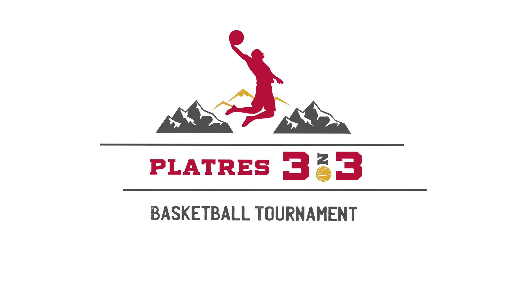

<html lang="el">      

<body>
    <h1> Platres 3on3 Basketball Tournament</h1>
    <ul>
    <li>Ημερομηνία : 2 Ιουνίου 2024.</li> 
    <li>Τοποθεσία : <a href="https://platresarena.com/">Platres Arena</a>, Πλάτρες.</li>
</ul>
    

Μετά από μια επιτυχημένη χρονιά, το <b>Platres 3on3</b> επιστρέφει στο γήπεδο των Πάνω Πλατρών για μια ακόμη διοργάνωση, με τον κύριο στόχο να υποστηρίξει το Europa Donna Cyprus και το <b>Ίδρυμα Μικροί Ήρωες</b>. Όπου αυτοί οι δύο μη κερδοσκοπικοί οργανισμοί παρέχουν σημαντική βοήθεια και υποστήριξη σε άτομα όλων των ηλικιών που αγωνίζονται με τον καρκίνο.
    

    

Η πρωτοβουλία αυτή ηγείται από μικρή ομάδα νέων εθελοντών, οι οποίοι, με ενθουσιασμό, αφοσίωση και δυναμισμό, ξεκίνησαν αυτή την άοκνη προσπάθεια. Στόχος τους είναι να αποτελέσουν έναν από τους πυλώνες υποστήριξης για τους συναθρώπους μας που δίνουν μάχη με τον καρκίνο καθημερινά και ταυτόχρονα να αναδείξουν ότι οι νέοι μπορούν να αποτελέσουν στηλοβάτες στην μακροχρόνια και αλτρουιστική προσπάθεια αυτών των ανθρώπων.
   
 
<h5>Οι εγγραφές θα είναι ανοικτές από 1 Μαίου έως 29 Μαΐου 2024 μέσω του συνδέσμου <a href="https://forms.office.com/r/NkmdV3gJKs?origin=lprLink">εδώ</a>.</h5>
    
<h5>Το κόστος εγγραφής μια ομάδας ανέρχεται στα €140 (4 άτομα) το οποίο θα καλύπτει :</h5>
<ul>
    <li>εγγραφή στο Platres 3on3 Basketball Tournament.</li> 
    <li>διπλής όψης καλαθοσφαιρικής στολής.</li>
    <li>χρηματική συνεισφορά στους δύο οργανισμούς.</li>
</ul>  

<h5>Για περισσότερες πληροφορίες:</h5> 

        Email: <a href="mailto:platres3on3@outlook.com">platres3on3@outlook.com</a>  
        Phone:  99909580 / 99342037  
        Instagram : <a href="https://www.instagram.com/platres3on3/?igsh=ZTFxa2R1MnJ0NGlk&utm_source=qr">platres3on3</a>

   
</body>
</html>
